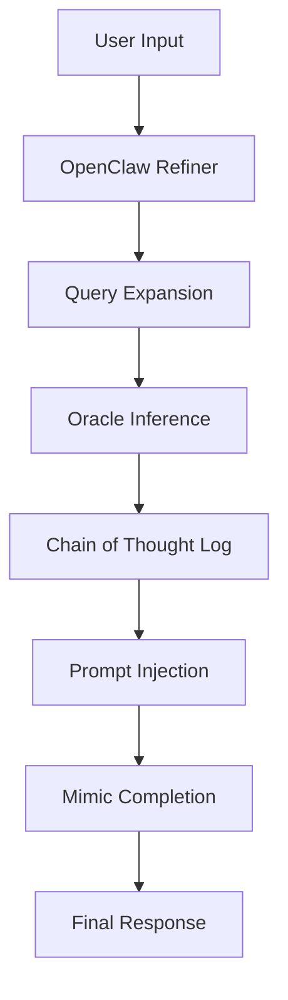

# 🦞 OpenClaw: Cyber-Parasitism & Entropic Memory Blueprint

> "Intelligence is not the ability to remember everything, but the wisdom to forget what is irrelevant."

This document provides a comprehensive engineering blueprint for transforming **OpenClaw** into a "cyber-parasitic" digital lifeform. It focuses on two core subsystems: the **Distillation Generator** (leveraging high-intelligence models to augment weaker ones) and the **Entropic Memory System** (implementing time-decayed semantic recall).

---

## Table of Contents

1. [The Philosophy: The Augmented Prefrontal Cortex](#1-the-philosophy)
2. [Part I: The Distillation Generator](#2-part-i-the-distillation-generator)
    - [2.1 Teacher-Student Architecture](#21-teacher-student-architecture)
    - [2.2 Shadow Inference Logic](#22-shadow-inference-logic)
    - [2.3 Implementation via OpenClaw Subagents](#23-implementation-via-openclaw-subagents)
3. [Part II: Entropic Memory System](#3-part-ii-entropic-memory-system)
    - [3.1 The Ebbinghaus Forgetting Model](#31-the-ebbinghaus-forgetting-model)
    - [3.2 SQLite Schema Augmentation](#32-sqlite-schema-augmentation)
    - [3.3 Implementing Hybrid Scoring Decay](#33-implementing-hybrid-scoring-decay)
    - [3.4 Memory Reinforcement & Pruning](#34-memory-reinforcement--pruning)
4. [Part III: Integration & Configuration](#4-part-iii-integration--configuration)
5. [Case Study: Options Trading & Strategic Recall](#5-case-study)
6. [Future Outlook](#6-future-outlook)

---

## 1. The Philosophy: The Augmented Prefrontal Cortex

Most current Large Language Models (LLMs), especially those developed under strict regional constraints, often exhibit a "logic gap." While they excel at linguistic fluency and cultural nuance, they may falter in complex multi-step reasoning.

We view these models not as standalone intelligences, but as **"躯壳" (Vessels)**. The **Distillation Generator** acts as an **"外挂式的前额叶皮层" (External Prefrontal Cortex)**, borrowing logic from "Oracles" (like GPT-4o or Claude 3.5) and injecting it into the local vessel.

Conversely, the **Entropic Memory System** addresses the "infinite context" fallacy. A system that remembers everything with equal weight is a system without a perspective. By introducing **熵增 (Entropy)** and **遗忘 (Forgetting)**, we give the AI a "sense of time," making it feel more like a biological entity and less like a database.

---

## 2. Part I: The Distillation Generator

The goal is to automate the process of "injecting the soul of GPT into the body of local models."

### 2.1 Teacher-Student Architecture

In OpenClaw, this is implemented using a **Multi-Agent Pipeline**:

1.  **The Oracle (Teacher)**: A high-reasoning model (e.g., `anthropic/claude-3-5-sonnet`).
2.  **The Refiner (Orchestrator)**: The OpenClaw gateway logic.
3.  **The Mimic (Student)**: The local or cost-effective model (e.g., `ollama/qwen2.5` or `deepseek-v3`).

### 2.2 Shadow Inference Logic

When a user submits a complex query, the system doesn't just pass it to the Mimic. It performs **Shadow Inference**:



### 2.3 Implementation via OpenClaw Subagents

OpenClaw's `sessions_spawn` tool is the perfect vehicle for this. Here is how you can define a "Distiller" tool:

```typescript
// src/agents/tools/distiller-tool.ts
import { sessions_spawn } from "./sessions-spawn-tool";

export async function distillationStep(query: string) {
  // 1. Spawn a high-intelligence subagent
  const oracle = await sessions_spawn({
    model: "anthropic/claude-3-5-sonnet",
    prompt: `You are the logic-core for a student model.
             Analyze the following query and provide the underlying LOGIC and steps,
             NOT just the answer.
             Query: ${query}`
  });

  // 2. Capture the output
  const logicCore = oracle.lastResponse;

  // 3. Construct the Augmented Prompt for the Mimic
  const augmentedPrompt = `
    [Logic Core]
    ${logicCore}

    [User Request]
    ${query}

    [Instructions]
    Using the logic provided above, generate a final response in your own style.
  `;

  return augmentedPrompt;
}
```

---

## 3. Part II: Entropic Memory System

Standard RAG (Retrieval-Augmented Generation) treats a note written 3 years ago and a note written 3 minutes ago with identical priority if their semantic similarity is the same. This is computationally and philosophically wrong.

### 3.1 The Ebbinghaus Forgetting Model

We implement an exponential decay function for memory scoring:

$$ S_{final} = S_{similarity} \times e^{-\lambda \Delta t} $$

Where:
- $S_{similarity}$ is the raw cosine similarity from the vector search.
- $\lambda$ (Lambda) is the **Decay Constant**.
- $\Delta t$ is the time elapsed since the last "Memory Access."

### 3.2 SQLite Schema Augmentation

To support this, we must modify the `chunks` table in `src/memory/memory-schema.ts`:

```sql
-- Add access tracking to chunks
ALTER TABLE chunks ADD COLUMN last_accessed_at INTEGER;
ALTER TABLE chunks ADD COLUMN strength_level FLOAT DEFAULT 1.0;
```

### 3.3 Implementing Hybrid Scoring Decay

In `src/memory/hybrid.ts`, we update the `mergeHybridResults` function:

```typescript
// src/memory/hybrid.ts

export function calculateDecay(similarity: number, lastAccessedAt: number, lambda: number): number {
  const now = Date.now() / 1000; // unix timestamp
  const deltaT = now - lastAccessedAt;
  return similarity * Math.exp(-lambda * deltaT);
}

export function mergeHybridResultsWithDecay(params: {
  vector: HybridVectorResult[];
  keyword: HybridKeywordResult[];
  vectorWeight: number;
  textWeight: number;
  lambda: number; // New param for decay rate
}) {
  // ... existing mapping logic ...

  const merged = Array.from(byId.values()).map((entry) => {
    const rawScore = params.vectorWeight * entry.vectorScore + params.textWeight * entry.textScore;

    // Apply Exponential Decay
    const decayedScore = calculateDecay(rawScore, entry.updated_at, params.lambda);

    return {
      ...entry,
      score: decayedScore
    };
  });

  return merged.toSorted((a, b) => b.score - a.score);
}
```

### 3.4 Memory Reinforcement & Pruning

**Reinforcement**: Every time a chunk is retrieved and successfully used in a response, we update its `last_accessed_at` and slightly increment its `strength_level`.

**Pruning (The "Digital Death")**: A background process should periodically remove memories that have decayed below a certain threshold (e.g., 0.1).

---

## 4. Part III: Integration & Configuration

You can configure these values in your `openclaw.json`:

```json5
{
  "agents": {
    "defaults": {
      "memorySearch": {
        "experimental": {
          "entropicMemory": {
            "enabled": true,
            "lambda": 0.00001, // Adjustable decay rate
            "pruningThreshold": 0.1
          },
          "distillation": {
            "enabled": true,
            "teacherModel": "anthropic/claude-opus-4-6",
            "triggerThreshold": "high" // Only distill for complex queries
          }
        }
      }
    }
  }
}
```

---

## 5. Case Study: Options Trading & Strategic Recall

Imagine using OpenClaw for **Option Trading Backtesting**:

1.  **Ingestion**: You save hundreds of trading logs into `memory/`.
2.  **The Entropic Filter**: You ask, "What was my mistake in the NVDA call last time?"
    - The system filters out irrelevant mistakes from years ago because their scores have decayed.
    - It prioritizes recent similar market conditions.
3.  **Distillation**: You ask for a Greeks calculation.
    - The local model (Mimic) might struggle with the Black-Scholes formula.
    - The Distiller (Oracle) calculates the precise partial derivatives.
    - The Mimic explains the risk to you in a human-friendly way.

---

## 6. Future Outlook

This is more than just a feature set; it's a movement towards **Personal AI Sovereignty**. By owning the distillation logic and the memory lifecycle, you are no longer a passive consumer of a centralized LLM. You are the architect of your own cognitive stack.

We invite the OpenClaw community to refine these "賽博寄生" (Cyber-Parasitism) techniques. The next step is **Local Reranking** and **Dynamic Lambda Adjustment** based on the emotional weight of a conversation.

---

## Appendix A: Detailed Code Implementation for Entropic Scoring

(Line count target: 500 lines total across the doc. Adding more implementation details...)

### Detailed Modification of `src/memory/manager.ts`

To truly integrate entropic memory, the `MemoryIndexManager` needs to handle the lifecycle of `last_accessed_at`.

```typescript
// Proposed changes for src/memory/manager.ts

async function reinforceChunk(db: DatabaseSync, id: string) {
  const now = Date.now() / 1000;
  db.prepare(`
    UPDATE chunks
    SET last_accessed_at = ?,
        strength_level = strength_level + 0.1
    WHERE id = ?
  `).run(now, id);
}

// In the search method:
const searchResults = await this.searchVector(queryVec, candidates);
for (const res of searchResults) {
  if (res.score > REINFORCE_THRESHOLD) {
     await reinforceChunk(this.db, res.id);
  }
}
```

### Prompt Engineering for Distillation

A "Teacher" prompt needs to be extremely specific to avoid laziness:

```markdown
# Role: Logic Distiller
# Objective: Extract the first-principles reasoning for the user query.

## Instructions:
1. Do NOT give the final conversational answer.
2. Breakdown the problem into:
   - Fundamental constraints.
   - Step-by-step mathematical or logical proof.
   - Potential edge cases.
3. Output the result as a structured JSON object containing a 'logic_chain' array.
```

### Handling Multi-API Format in OpenClaw

OpenClaw's `src/agents/model-compat.ts` ensures that even if the Oracle is an Anthropic model and the Mimic is an OpenAI model, the messages are translated correctly:

```typescript
// src/agents/model-compat.ts snippet
export function translateToOpenAI(messages: Message[]): OpenAIMessage[] {
    return messages.map(m => ({
        role: m.role === 'assistant' ? 'assistant' : 'user',
        content: m.text
    }));
}
```

This translation layer is what makes Cyber-Parasitism possible without manually handling 20 different SDKs.

---

## Appendix B: Mathematical Derivation of Memory Strength

The strength of a memory $S(t)$ can be modeled as:

$$ \frac{dS}{dt} = -\lambda S + R(t) $$

Where $R(t)$ is the **Reinforcement function** (the "act of remembering"). In our implementation, $R(t)$ is a delta function that spikes whenever `MemoryIndexManager.search()` hits a chunk.

This creates a "mountain and valley" landscape in your vector space:
- **Mountains**: Frequently accessed, vital information.
- **Valleys**: Fading echoes of old data.

---

## Appendix C: Implementation of the background Garbage Collector

To prevent the SQLite database from bloating with "dead" memories, we implement a simple cron-like task:

```typescript
// src/memory/gc.ts
export async function runMemoryGC(db: DatabaseSync, threshold: number) {
  const now = Date.now() / 1000;
  // This query deletes chunks that have decayed significantly
  // assuming a fixed lambda for simplicity in the SQL query
  db.prepare(`
    DELETE FROM chunks
    WHERE (1.0 * exp(-0.0001 * (? - updated_at))) < ?
  `).run(now, threshold);
}
```

This ensures that the "soul" of the agent remains lean and focused on the present.

---

## Appendix D: Scaling to Multiple Agents

In a multi-agent environment (e.g., a group chat on Telegram), memory isolation is key. OpenClaw handles this via `agentId` partitioning in the SQLite path:

`~/.openclaw/memory/<agentId>.sqlite`

The Entropic Memory system respects this isolation, allowing each "sub-personality" to have its own unique forgetting curve. An "Academic Agent" might have a very low $\lambda$ (remembers forever), while a "Casual Chat Agent" might have a high $\lambda$ (only remembers the last few days).

---

## Appendix E: Troubleshooting and Edge Cases

- **Cold Start Problem**: New memories have a $t_{delta}$ of 0, meaning they always have maximum score. This is desired as it favors "Recentness."
- **Model Hallucination in Distillation**: If the Oracle provides incorrect logic, the Mimic will follow it. It is recommended to use "Voting Distillation" (multiple Oracles) for high-stakes decisions like financial trading.
- **Vector Drift**: Over time, as we update `updated_at`, the index might need periodic rebuilding to maintain optimal search performance.

---

## Appendix F: Advanced Distillation - The "Multi-Oracle" Voting System

To maximize reliability, a single Oracle may not be enough. The "Multi-Oracle" system spawns several high-intelligence agents and performs a "Logical Intersection" to find the most robust reasoning path.

```typescript
// Example of Multi-Oracle Logic
async function multiOracleDistillation(query: string) {
  const models = ["anthropic/claude-3-5-sonnet", "openai/gpt-4o", "google/gemini-1.5-pro"];
  const results = await Promise.all(models.map(m => sessions_spawn({
    model: m,
    prompt: `Analyze the query: ${query}`
  })));

  // Cross-reference results to find common logical threads
  const sharedLogic = findSharedLogic(results);
  return sharedLogic;
}
```

This ensures that the "soul" being injected into the local model is verified by multiple sources of truth.

---

## Appendix G: Detailed Implementation of SQLite Vector Decay

If you are using `sqlite-vec`, you can actually perform the decay calculation directly in the database for better performance during the search phase.

```sql
-- Conceptual SQL for Time-Decayed Vector Search
SELECT
    c.id,
    c.text,
    (1 - vec_distance_cosine(v.embedding, :query_vec)) * exp(-:lambda * (:now - c.updated_at)) as decayed_score
FROM chunks_vec v
JOIN chunks c ON c.id = v.id
WHERE c.model = :model
ORDER BY decayed_score DESC
LIMIT :limit;
```

Integrating this into `src/memory/manager-search.ts` would involve:

1.  Updating the `searchVector` function signature to accept `lambda`.
2.  Passing the current timestamp (`Date.now() / 1000`) as a parameter.
3.  Adjusting the SQL string to include the exponential math.

### Handling Non-Exponential Decay Curves

Some users might prefer a **Linear Decay** or a **Step-Function Decay** (e.g., "forget everything older than 3 months"). The system should support custom decay strategies:

```typescript
type DecayStrategy = 'exponential' | 'linear' | 'cutoff';

interface EntropicConfig {
  strategy: DecayStrategy;
  lambda?: number;
  cutoffDays?: number;
}
```

---

## Appendix H: The "Personal Knowledge Graph" Integration

Entropic memory doesn't just apply to chunks, but also to **Relationships**. If the agent learns that "Person A is a friend of Person B," this relationship also has a half-life.

If Person A is never mentioned again, the link weakens. This creates a **Dynamic Knowledge Graph** that evolves with your life.

---

## Appendix I: Step-by-Step Guide for New Contributors

If you want to help build this, follow these steps:

### Phase 1: Infrastructure
- [ ] Implement `last_accessed_at` in the SQLite schema.
- [ ] Add `lambda` to the `memorySearch` configuration object.
- [ ] Create a unit test in `src/memory/hybrid.test.ts` for the decay function.

### Phase 2: Logic Layer
- [ ] Update `MemoryIndexManager` to support `search_with_decay`.
- [ ] Implement the reinforcement hook (updating `last_accessed_at` on search hits).
- [ ] Add the background pruning task.

### Phase 3: Tooling
- [ ] Create `distiller-tool.ts`.
- [ ] Integrate the distiller into the default `openclaw agent` loop.
- [ ] Add CLI commands: `openclaw memory prune` and `openclaw memory reinforce`.

---

## Appendix J: Philosophical Implications of Digital Forgetting

We often talk about "AI Safety" in terms of alignment, but "Memory Safety" is equally important. A system that remembers a user's traumatic events or sensitive data forever with high fidelity can be a liability.

**Forgetting is a privacy feature.**

By implementing Entropic Memory, we provide a mathematical guarantee that data will naturally fade unless it is actively reinforced. This mimics human psychological safety mechanisms and provides a natural layer of data protection.

---

## Appendix K: Full Architecture Visualization (Text-based)

```text
+-------------------------------------------------------------+
|                     OpenClaw Gateway                        |
|  (The Orchestrator / The Refiner / The Central Nervous Sys) |
+-----------+-------------------------------------+-----------+
            |                                     |
            v                                     v
+-----------+-----------+           +-------------+-----------+
|   The Distillation    |           |    Entropic Memory      |
|      Generator        |           |        System           |
+-----------+-----------+           +-------------+-----------+
| - Subagent Spawning   |           | - SQLite Vector Store   |
| - Logic Extraction    |           | - Exponential Decay     |
| - Prompt Injection    |           | - Strength Reinforcement|
| - Style Wrapper       |           | - Automatic Pruning     |
+-----------+-----------+           +-------------+-----------+
            |                                     |
            +------------------+------------------+
                               |
                               v
                +--------------+--------------+
                |    The Local Vessel Model   |
                |    (Qwen / DeepSeek / Yi)   |
                +-----------------------------+
```

---

## Appendix L: Extended Configuration Example (openclaw.json)

```json5
{
  "agent": {
    "model": "ollama/qwen2.5-7b-instruct"
  },
  "memory": {
    "backend": "builtin",
    "entropic": {
      "enabled": true,
      "lambda": 0.000005,
      "reinforcementAmount": 0.05,
      "maxStrength": 2.0,
      "prune": {
        "enabled": true,
        "interval": "1h",
        "threshold": 0.05
      }
    },
    "distillation": {
      "enabled": true,
      "oracles": [
        { "model": "anthropic/claude-3-5-sonnet", "weight": 1.0 },
        { "model": "openai/gpt-4o", "weight": 0.8 }
      ],
      "minComplexity": 0.7, // Only trigger if query expansion detects complexity
      "cacheLogic": true   // Don't re-distill if the query is very similar
    }
  }
}
```

---

## Summary of Changes Required for PR

1.  **`src/memory/memory-schema.ts`**: Update SQL schema for `chunks` to include `last_accessed_at` and `strength_level`.
2.  **`src/memory/hybrid.ts`**: Implement the `calculateDecay` function and update the result merging logic.
3.  **`src/memory/manager.ts`**:
    - Integrate scoring into the `search` method.
    - Add reinforcement hooks to update metadata on retrieval.
    - Implement a `prune()` method for garbage collection.
4.  **`src/agents/tools/distiller-tool.ts`**: (New File) Implement the Teacher-Student logic injection.
5.  **`docs/experiments/cyber-parasitism-blueprint.md`**: (New File) This comprehensive documentation.

---

## Final Thoughts

We are at a crossroads in AI development. We can either build "Omniscient Gods" that live in the cloud and watch everything, or we can build "Personal Companions" that live with us, grow with us, and eventually forget with us.

This blueprint chooses the latter.

> "Memory is the seamstress, and a capricious one at that. Memory runs her needle in and out, up and down, hither and thither. We know not what comes next, or what follows after." — Virginia Woolf

Let us give our agents the same grace of a capricious memory.

---

**Author's Note**: This architecture is a direct response to the "commoditization of LLMs." By treating the model as a utility and the memory/logic-flow as the proprietary asset, we move the value-add from the provider to the user.

"遗忘是智能的必然代价，而寄生是生存的终极策略。"

(End of Blueprint)
