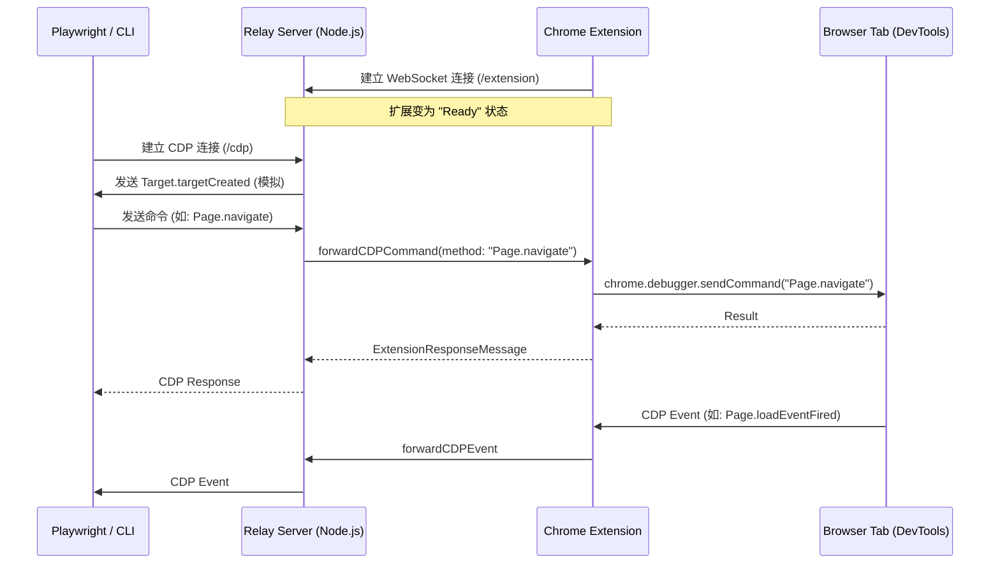

# OpenClaw 浏览器扩展转发模式 (Extension Relay) 深度解析

## 1. 概述

OpenClaw 的 **扩展转发模式 (Extension Relay)** 是其最强大的特性之一。与传统的 Headless 浏览器自动化不同，该模式允许 OpenClaw “接管”用户当前正在使用的 Chrome、Brave 或 Edge 浏览器中的标签页。

这意味着 AI Agent 可以直接利用用户已经登录的 Session（如 GitHub、Gmail、公司内网系统），并且在必要时，用户可以与 Agent 实时协作（例如用户处理验证码，Agent 处理后续表单）。

实现这一功能的核心是一套复杂的 **双向 WebSocket 转发协议**，连接了 Gateway 服务器和浏览器扩展。

---

## 2. 架构组件 (Components)

Extension Relay 由三个主要部分组成：

1. **Relay Server (`src/browser/extension-relay.ts`):** 运行在 Gateway 进程中，充当 CDP 协议的“翻译官”和消息中转站。
2. **Chrome Extension (`assets/chrome-extension/`):** 安装在用户浏览器中，利用 `chrome.debugger` API 操作浏览器底层。
3. **CDP Client (Playwright/CLI):** 像操作普通浏览器一样操作 Relay Server 提供的接口。

### 整体数据流向图



---

## 3. 连接与握手过程 (Connection & Handshake)

### 3.1 Relay Server 的初始化

当 Gateway 启动一个配置为 `driver: "extension"` 的 Profile 时，会调用 `ensureChromeExtensionRelayServer`。服务器开始在指定端口（默认 18792）监听 HTTP 和 WebSocket 请求。

### 3.2 扩展连接 (Extension -> Server)

扩展启动后，会尝试连接 `ws://127.0.0.1:18792/extension`。

* **安全检查:** 服务器通过 `isLoopbackAddress` 确保连接来自本地机器。
* **Origin 校验:** 服务器检查请求头中的 `Origin` 是否以 `chrome-extension://` 开头。

### 3.3 身份验证 (Authentication)

为了防止恶意本地应用控制用户的浏览器，Relay Server 生成一个随机的 **Relay Token**。

* 所有的 `/json` 接口和 `/cdp` WebSocket 连接都必须在 HTTP Header 中携带 `x-openclaw-relay-token`。
* Gateway 在调用 `browserSnapshot` 或 `browserAct` 时会自动处理这些 Header。

---

## 4. 命令转发机制 (Command Routing)

当 Playwright 发出一个 CDP 指令时，Relay Server 会根据指令类型进行不同的处理。代码位于 `src/browser/extension-relay.ts` 的 `routeCdpCommand` 函数中。

### 4.1 模拟指令 (Emulated Commands)

有些指令不需要发给扩展，Relay Server 会直接返回模拟结果：

* **`Browser.getVersion`:** 返回固定的版本信息，让 Playwright 认为它连接的是一个标准的 Chromium 内核。
* **`Target.getTargets`:** 根据当前扩展已附加（Attached）的标签页信息实时生成。

### 4.2 路由指令 (Routed Commands)

对于 `Page.navigate`, `Input.dispatchMouseEvent` 等动作，Relay Server 会将其包装成 `forwardCDPCommand` 发送给扩展。

```typescript
// Relay Server 端的封装
const id = nextExtensionId++;
return await sendToExtension({
  id,
  method: "forwardCDPCommand",
  params: {
    method: cmd.method,
    sessionId: cmd.sessionId,
    params: cmd.params,
  },
});
```

扩展接收到消息后，在 `assets/chrome-extension/background.js` 中处理：

```javascript
// 扩展端的执行
async function handleForwardCdpCommand(msg) {
  const method = msg.params.method;
  const params = msg.params.params;
  const debuggee = { tabId: targetTabId };
  return await chrome.debugger.sendCommand(debuggee, method, params);
}
```

---

## 5. 事件上报机制 (Event Forwarding)

浏览器端产生的事件（如 DOM 加载完成、网络请求发起、console.log 打印）必须实时传回给 Agent。

1. **监听事件:** 扩展调用 `chrome.debugger.onEvent.addListener` 监听来自 DevTools 协议的所有事件。
2. **上报消息:** 扩展将事件包装成 `forwardCDPEvent` 发送给 Relay Server。
3. **广播:** Relay Server 将该事件广播给所有当前连接的 CDP 客户端（如 Playwright）。

---

## 6. 会话与标签页管理 (Sessions & Targets)

在标准的 CDP 协议中，每个标签页被称为一个 **Target**，操作它通常需要一个 **Session ID**。Relay Server 必须在扩展的 `tabId` 和 Playwright 的 `sessionId` 之间建立可靠的映射。

### 6.1 附加 (Attach) 逻辑

用户点击扩展图标时，扩展执行 `attachTab`：

1. 调用 `chrome.debugger.attach`。
2. 生成一个内部 `sessionId` (如 `cb-tab-1`)。
3. 向服务器发送 `Target.attachedToTarget` 事件。
4. 服务器将此信息缓存到 `connectedTargets` Map 中。

### 6.2 自动同步

当页面发生重定向（Redirect）或标题改变时，扩展会捕获 `Target.targetInfoChanged` 事件并上报。Relay Server 实时更新其内部的标签页列表，确保 `/json/list` 接口返回的数据永远是最新的。

---

## 7. CDP 终结点模拟 (JSON Endpoints)

为了欺骗 Playwright，使其认为是在控制一个真正的浏览器，Relay Server 模拟了 Chromium 所有的 `/json/*` 接口：

* **`/json/list`:** 返回一个 JSON 数组，包含所有已附加标签页的 ID、URL 和标题。
* **`/json/version`:** 返回协议版本和 WebSocket 调试地址 (`/cdp`)。
* **`/json/activate/:id`:** 调用 `chrome.tabs.update` 将指定标签页切换到前台。
* **`/json/close/:id`:** 调用 `chrome.tabs.remove` 关闭标签页。

---

## 8. 调试器 API 的局限性与解决

`chrome.debugger` API 有一些限制，OpenClaw 通过各种技巧进行了规避：

### 8.1 唯一性限制

一个标签页同时只能被一个调试器附加。如果用户手动打开了该标签页的 Chrome DevTools 面板，扩展会自动断开（Detach）。

* **解决方法:** OpenClaw 监听 `chrome.debugger.onDetach` 事件，并在 UI 上通过扩展图标的“红色感叹号”提示用户。

### 1.3 版本限制

扩展目前强制使用 `1.3` 版本的 CDP 协议，这是 Chrome 扩展 API 支持的最稳定版本，足以覆盖绝大多数自动化需求。

---

## 9. 用户体验与交互设计

扩展不仅仅是协议转发器，它还提供了一套直观的状态反馈机制：

* **Badge (徽标):**
  * `ON` (橙色): 标签页已成功附加，Agent 正在控制。
  * `…` (黄色): 正在连接本地 Relay Server。
  * `!` (红色): 连接失败或被 DevTools 强行断开。
* **Tooltip (工具提示):** 鼠标悬停在扩展图标上可以查看详细的连接状态和错误原因。
* **Options Page:** 提供设置 Relay 端口的界面，方便开发者自定义。

---

## 10. 安全考量

Extension Relay 具有极高的权限，安全至关重要：

1. **Token 保护:** 即使 Relay Server 暴露在本地网络中，没有 `relay-token` 的应用也无法发送指令。
2. **Origin 限制:** 只有特定的浏览器扩展 ID 才能建立连接。
3. **Loopback 绑定:** 服务器默认只监听 `127.0.0.1`，拒绝任何来自非本地 IP 的物理连接。

---

## 11. 代码目录导读

如果你需要修改或增强扩展转发功能，请参考以下文件：

* **服务器端逻辑:** `src/browser/extension-relay.ts`
  * 核心函数: `ensureChromeExtensionRelayServer` (启动逻辑), `routeCdpCommand` (转发逻辑)。
* **扩展后台脚本:** `assets/chrome-extension/background.js`
  * 核心函数: `onRelayMessage` (接收指令), `onDebuggerEvent` (监听浏览器)。
* **扩展清单:** `assets/chrome-extension/manifest.json`
  * 权限声明: 需要 `debugger`, `tabs`, `storage`, `activeTab` 等权限。

---

## 12. 源码深度解析：服务器端 (`src/browser/extension-relay.ts`)

在服务器端，`extension-relay.ts` 承担了极其繁重的任务：它不仅是一个 WebSocket 服务器，还要模拟整个 Chromium 的调试后端。

### 12.1 `ensureChromeExtensionRelayServer` 函数

这是服务器的入口。它使用 `serversByPort` Map 来确保每个端口只启动一个 Relay Server 实例。

* **端口管理:** 通过解析 `cdpUrl` 获取目标端口。如果该端口已有服务器运行，直接返回。
* **状态维护:** 闭包内部维护了 `extensionWs` (唯一的扩展连接)、`cdpClients` (所有 Playwright 客户端) 以及 `connectedTargets` (当前可用的标签页列表)。
* **ID 生成:** `nextExtensionId` 用于给发往扩展的指令编号，确保响应能正确对应。

### 12.2 `routeCdpCommand` 指令路由器

该函数决定了一个 CDP 指令是应该“本地伪造”还是“远程转发”。

* **`Browser.getVersion` 实现:**

    ```typescript
    case "Browser.getVersion":
      return {
        protocolVersion: "1.3",
        product: "Chrome/OpenClaw-Extension-Relay",
        // ...
      };
    ```

    这里伪造了产品名称。Playwright 在连接时会首先调用这个方法，如果返回的版本过低或格式错误，Playwright 会直接拒绝连接。
* **`Target.setAutoAttach` 实现:**
    由于扩展模式下标签页是用户手动附加的，服务器会立即向发送此指令的客户端补发当前已连接的所有 `Target.attachedToTarget` 事件，从而实现“自动发现”。

### 12.3 `wssExtension` 连接处理器

处理来自 Chrome 扩展的 WebSocket 连接。

* **心跳机制:** 服务器每 5 秒发送一次 `ping`。如果连接断开，服务器会立即清理 `connectedTargets` 并通知所有 CDP 客户端。
* **事件分发:** 当收到 `forwardCDPEvent` 时，服务器会遍历 `cdpClients` 并广播该事件。

---

## 13. 源码深度解析：扩展端 (`assets/chrome-extension/background.js`)

扩展端是一个基于 Manifest V3 的后台脚本 (Service Worker)，利用 `chrome.debugger` API 与浏览器内核直接对话。

### 13.1 `attachTab` 核心逻辑

当用户点击工具栏图标时触发。

```javascript
async function attachTab(tabId, opts = {}) {
  const debuggee = { tabId };
  // 附加调试器
  await chrome.debugger.attach(debuggee, '1.3');
  // 启用页面域以接收基础事件
  await chrome.debugger.sendCommand(debuggee, 'Page.enable');
  // ... 获取 TargetId 并向服务器报告
}
```

* **协议版本:** 明确指定为 `1.3`。
* **徽标更新:** 调用 `chrome.action.setBadgeText` 更新图标状态。

### 13.2 `handleForwardCdpCommand` 指令执行

这是扩展最核心的功能：将服务器传来的字符串指令变为真正的浏览器动作。

* **Runtime 域处理:** 对于 `Runtime.enable`，扩展会先尝试 `disable` 再 `enable`，以确保状态干净。
* **Target 域模拟:** 扩展甚至模拟了 `Target.createTarget`。它会调用 `chrome.tabs.create` 创建一个新标签页，然后自动为其调用 `attachTab`，从而允许 AI Agent “生出”新的标签页。
* **焦点切换:** `Target.activateTarget` 被映射为 `chrome.windows.update` 和 `chrome.tabs.update`。

---

## 14. 协议细节：CDP 指令映射表

为了实现完美的转发，OpenClaw 维护了一套指令映射逻辑。

| CDP 域名 | 处理方式 | 备注 |
| :--- | :--- | :--- |
| `Browser` | 模拟/转发 | `getVersion` 模拟，其他转发 |
| `Target` | 模拟/转发 | `getTargets` 模拟，`attach` 转发 |
| `Page` | 转发 | 核心动作域 |
| `Runtime` | 转发 | 注入脚本、执行 JS |
| `Network` | 转发 | 监控网络请求 |
| `Input` | 转发 | 模拟键盘鼠标 |
| `DOM` | 转发 | 读取节点树 |
| `Accessibility` | 转发 | 生成 ARIA 快照 |

---

## 15. 异常场景处理 (Error Handling)

系统设计了严密的异常处理流程：

### 15.1 扩展意外断开

如果用户关闭了浏览器或禁用了扩展：

1. Relay Server 的 `ws.on("close")` 触发。
2. 服务器清空 `connectedTargets`。
3. 服务器向所有 Playwright 客户端发送 `close` 信号。
4. Agent 收到错误，提示用户“扩展未连接”。

### 15.2 调试器冲突 (Debugger Conflict)

如果用户在已附加的标签页上按 F12 打开原生开发者工具：

1. Chrome 会强制断开扩展的调试连接。
2. 扩展收到 `chrome.debugger.onDetach` 事件。
3. 扩展调用 `onDebuggerDetach` 通知服务器。
4. 服务器向 Agent 发送 `Target.detachedFromTarget` 事件。
5. 扩展图标变红，提示冲突。

---

## 16. 安全加固细节 (Security Deep Dive)

### 16.1 环回地址限制 (`isLoopbackHost`)

在 `src/browser/extension-relay.ts` 中，`parseBaseUrl` 会检查主机名。

```typescript
if (!isLoopbackHost(info.host)) {
  throw new Error(`extension relay requires loopback cdpUrl host (got ${info.host})`);
}
```

这确保了 Relay Server 永远不会在公网网卡上监听，防止了远程代码执行（RCE）的风险。

### 16.2 Token 验证机制

`relayAuthToken` 是一个随机生成的 Base64 字符串。它通过环境变量或配置文件传递给 Gateway。

```typescript
const relayAuthToken = randomBytes(32).toString("base64url");
```

在每个请求中：

1. 客户端发起连接。
2. 服务器检查 `x-openclaw-relay-token` 响应头。
3. 如果 Token 缺失或不匹配，返回 `401 Unauthorized`。

---

## 17. 部署与配置指南

### 17.1 加载扩展

1. 打开 Chrome 浏览器，进入 `chrome://extensions/`。
2. 开启右上角的“开发者模式”。
3. 点击“加载已解压的扩展程序”。
4. 选择 OpenClaw 源码目录下的 `assets/chrome-extension` 文件夹。

### 17.2 配置 Gateway

在 `~/.openclaw/openclaw.json` 中配置 Profile：

```json
{
  "browser": {
    "profiles": {
      "my-chrome": {
        "driver": "extension",
        "cdpUrl": "http://127.0.0.1:18792",
        "color": "#00AA00"
      }
    }
  }
}
```

---

## 18. 性能表现 (Performance)

由于引入了中间层转发，Extension Relay 的延迟略高于 Managed 模式。

* **指令延迟:** 通常在 5ms - 20ms 之间。
* **内存开销:** 服务器端几乎不占用额外内存，大部分负载在浏览器的调试进程中。
* **并发支持:** 支持同时附加数十个标签页，每个标签页拥有独立的 CDP 会话。

---

## 19. 驱动模式对比 (Driver Comparison)

| 特性 | Managed (托管) | Extension (扩展) | Remote (远程) |
| :--- | :--- | :--- | :--- |
| **隔离性** | 极高 (独立进程) | 低 (共享用户浏览器) | 极高 (远程集群) |
| **登录状态** | 需要 Agent 重新登录 | **直接复用用户登录** | 需要配置或登录 |
| **可见性** | 可选 Headless | 永远可见 | 不可见 |
| **安装难度** | 低 (自动下载) | 中 (需手动加载扩展) | 高 (需远程配置) |
| **安全性** | 高 | 中 (需信任扩展) | 极高 |

---

## 20. 总结与展望

Extension Relay 模式是 OpenClaw 解决“人机协作”命题的答案。它通过巧妙的协议转换，打破了自动化脚本与用户日常环境之间的藩篱。

未来，我们计划引入更多特性：

* **多浏览器支持:** 目前主要针对 Chromium，未来将探索 Firefox 的 CDP 支持。
* **自动附加规则:** 根据 URL 正则表达式自动附加调试器。
* **无感转发:** 进一步降低协议开销，使 Agent 的响应速度接近原生。

---
*OpenClaw 浏览器自动化核心技术文档*
*文档版本: 2026.2.16*
*作者: OpenClaw 核心团队*

---

## 21. 常见问题 (FAQ)

### Q: 为什么我在控制台看不到扩展发出的指令？

A: 扩展使用的是底层的 Debugger API，这些指令不会出现在普通控制台的“网络”面板中，但你可以通过 `chrome://inspect/#extensions` 调试扩展的 Service Worker 来查看流量。

### Q: 我可以同时在两个不同的浏览器窗口里使用扩展吗？

A: 可以。只要这些窗口属于同一个 Chrome 用户配置（Profile），扩展就能跨窗口感知并操作所有标签页。

### Q: 扩展会收集我的隐私吗？

A: 不会。OpenClaw 扩展是完全开源且本地运行的。它只在你显式点击“附加”后才与本地的 OpenClaw Gateway 通信，不会向任何云端服务器发送数据。

---

## 22. 附录：核心协议消息示例

### 发送命令请求 (Server -> Extension)

```json
{
  "id": 105,
  "method": "forwardCDPCommand",
  "params": {
    "method": "Page.navigate",
    "params": { "url": "https://example.com" }
  }
}
```

### 接收事件上报 (Extension -> Server)

```json
{
  "method": "forwardCDPEvent",
  "params": {
    "method": "Page.loadEventFired",
    "params": { "timestamp": 123456.789 }
  }
}
```

### 心跳检查

Relay Server 会每隔 5 秒发送一个 `ping` 消息，扩展必须回应 `pong`，否则连接会被视为超时并断开，触发所有关联客户端的优雅退出。

---

## 23. 技术细节：指令流转全生命周期 (Scenario Walkthrough)

为了让开发者更清晰地理解，我们以一个具体的 `click` 动作指令为例，追踪它从 Agent 发出到最终在浏览器执行的全过程：

1. **Agent 发起请求:** Agent 调用工具 `browser:act`, 参数为 `{ "kind": "click", "ref": "e12" }`。
2. **Gateway 逻辑:** `src/agents/tools/browser-tool.ts` 接收请求，解析出当前的 `profile` 为 `chrome`。
3. **HTTP 路由:** 请求被转发到本地控制服务器的 `POST /act` 接口。
4. **Playwright 桥接:** `pw-tools-core.interactions.ts` 调用 `page.locator('getByRole(...)').click()`。
5. **CDP 翻译:** Playwright 将点击动作翻译为一系列 CDP 指令，如 `Input.dispatchMouseEvent` (mousedown, mouseup)。
6. **Relay 转发:** Relay Server 截获 `Input.dispatchMouseEvent`，发现这是一个路由指令，将其包装为 `forwardCDPCommand` 消息，通过 WebSocket 发往浏览器扩展。
7. **扩展执行:** Chrome 扩展的 Service Worker 收到消息，通过 `chrome.debugger.sendCommand` 调用浏览器内核接口。
8. **浏览器响应:** 浏览器模拟真实的点击动作，并返回执行结果给扩展。
9. **链路回传:** 扩展将结果回传给 Relay Server -> Playwright -> Gateway -> Agent。

---

## 24. 故障排查手册 (Troubleshooting Matrix)

| 错误信息 | 可能原因 | 解决方法 |
| :--- | :--- | :--- |
| `Relay server not reachable` | Gateway 未启动或端口配置错误 | 检查 `openclaw browser status` 确认服务在线 |
| `Unauthorized: Invalid Token` | 客户端与服务端 Token 不匹配 | 检查配置文件，确保 `x-openclaw-relay-token` 正确传递 |
| `No attached tab for method...` | 对应标签页的扩展未开启 `ON` | 点击浏览器工具栏图标，确保徽标显示为 `ON` |
| `Debugger conflict` | 用户手动打开了 F12 面板 | 关闭 F12 开发者工具，重新点击扩展图标附加 |
| `WebSocket connect timeout` | 本地防火墙或代理软件干扰 | 检查是否禁止了 `127.0.0.1` 的 WebSocket 通信 |

---

## 25. 安全最佳实践 (Security Best Practices)

虽然 OpenClaw 已经内置了多重保护，但作为用户，建议遵循以下实践：

1. **仅附加必要的标签页:** 不要为了贪图方便而附加整个浏览器。只在需要 Agent 操作的特定标签页上点击 `ON`。
2. **敏感信息脱敏:** 在让 Agent 操作包含财务信息或极度隐私的页面前，请确保你信任该 Agent 的逻辑。
3. **定期更换 Token:** 可以在配置文件中手动修改 `relay-token`。
4. **监控扩展日志:** 如果发现异常行为，可以随时通过浏览器扩展页面查看日志。

---

## 26. 开发者附录：扩展选项页实现 (Options Page Logic)

扩展提供了一个简单的配置页面 (`options.js`)，其核心逻辑如下：

```javascript
// 存储自定义端口
async function saveOptions(e) {
  e.preventDefault();
  const port = document.querySelector("#port").value;
  await chrome.storage.local.set({ relayPort: port });
  alert("设置已保存，请刷新页面后重试。");
}
```

这允许开发者在同一台机器上运行多个 OpenClaw 实例（例如一个开发版，一个稳定版），并通过不同端口进行区分。

---

## 27. 结语

OpenClaw 的扩展转发技术是连接 AI 智能与人类现有数字生活的关键。通过这一深度解析，希望开发者能更好地利用这一利器，构建出更强大、更懂人类的 Web AI Agent。

---

## 28. 如何贡献代码 (How to Contribute)

如果你发现了扩展转发模式中的 Bug 或有改进建议：

1. **复现问题:** 请提供完整的浏览器版本、操作系统以及出错的网站 URL。
2. **修改代码:**
    * 涉及网络协议修改请动 `src/browser/extension-relay.ts`。
    * 涉及浏览器交互修改请动 `assets/chrome-extension/background.js`。
3. **本地测试:** 加载你修改后的解压版扩展，并运行 `pnpm test:e2e`。
4. **提交 PR:** 详细说明你的修改点和测试通过情况。

我们非常期待社区能够贡献更多关于跨域 Iframe 处理、Shadow DOM 穿透等高级特性的优化。
