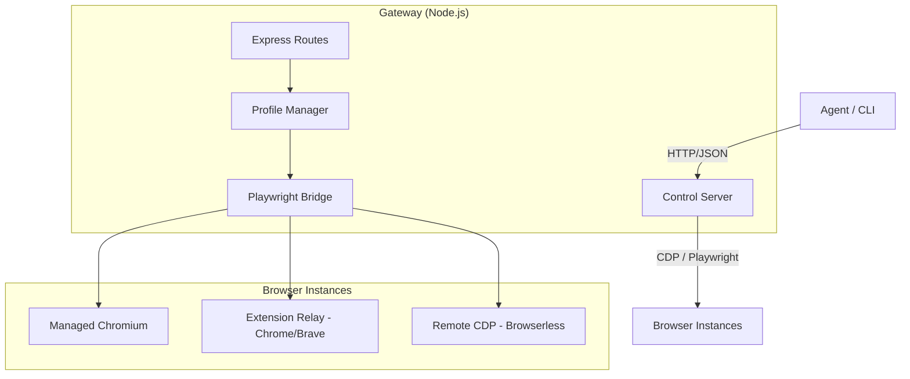
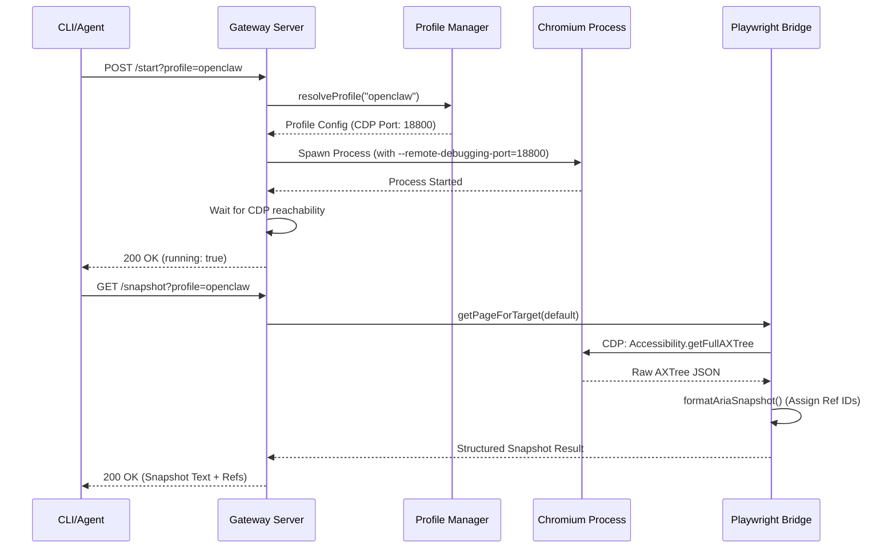

# OpenClaw Web-Using (浏览器自动化) 实现深度技术文档

## 1. 概述

OpenClaw 的 "Web-Using" 功能是其作为 AI 网关的核心能力之一。它允许 AI Agent 像人类一样与现代网页进行交互，包括打开 URL、点击按钮、填写表单、滚动页面、获取截图以及提取页面语义信息。

为了实现高度的兼容性和稳定性，OpenClaw 并没有简单的封装一个 Headless 浏览器，而是构建了一套完整的 **浏览器控制架构 (Browser Control Architecture)**。这套架构支持本地托管的 Chromium 实例，也支持通过 Chrome 扩展转发指令到用户的日常浏览器中。

本文档将深入分析 OpenClaw Web-Using 功能的代码实现、架构设计、网页理解算法以及 CLI 封装机制。

---

## 2. 架构设计 (Architecture)

OpenClaw 的浏览器自动化遵循客户端-服务端模型。

### 2.1 整体架构图



### 2.2 核心组件定义

1. **Client (Agent / CLI):** 指令的发起者。Agent 通过 `browser` 工具调用接口，用户通过 `openclaw browser` CLI 命令交互。
2. **Gateway Control Server:** 运行在 OpenClaw 后台的 Express 服务器。它监听本地回环地址（默认端口 18791），充当指令的中转站和协议转换器。
3. **Profile Manager:** 管理不同的浏览器配置文件。每个配置文件（Profile）可以有不同的驱动程序、用户数据目录和 CDP 端口。
4. **Playwright Bridge:** 将高级动作（如 `click`）转换为具体的 CDP 指令或 Playwright API 调用。
5. **Browser Instances:** 实际执行操作的浏览器。

---

## 3. 控制服务器实现 (Browser Control Server)

控制服务器的代码位于 `src/browser/server.ts`。它是一个轻量级的 Express 应用，提供了丰富的 API 接口。

### 3.1 路由结构

服务器的路由分为几个大类（见 `src/browser/routes/`）：

* **基础路由 (`basic.ts`):** 处理服务器状态、启动/停止浏览器、配置文件管理。
* **标签页路由 (`tabs.ts`):** 管理浏览器的 Tab 标签。包括列出所有标签、打开新标签、切换焦点、关闭标签等。
* **Agent 动作路由 (`agent.act.ts`):** 处理具体的交互动作，如 `navigate`, `click`, `type`, `scroll` 等。这些接口通常需要提供 `targetId`（标签页 ID）。
* **快照与观察路由 (`agent.snapshot.ts`):** 处理 `snapshot` (获取页面结构), `screenshot` (截图), `console` (获取控制台日志) 等。

### 3.2 生命周期管理

当用户执行 `openclaw browser start` 时：

1. `src/browser/profiles-service.ts` 会根据配置查找对应的浏览器可执行路径（如 Chrome 或 Brave）。
2. 调用 `src/browser/chrome.ts` 启动一个带有 `--remote-debugging-port` 参数的子进程。
3. 控制服务器会尝试连接该端口的 CDP 接口，确认浏览器已准备就绪。

---

## 4. 浏览器驱动技术 (Drivers)

OpenClaw 支持多种驱动模式，以适应不同的使用场景。

### 4.1 托管模式 (Managed Driver)

这是默认模式。OpenClaw 会启动一个独立的 Chromium 进程，并为其分配一个独立的用户数据目录（`~/.openclaw/browser-data/`）。这种模式的优点是：

* **完全隔离:** 不会干扰用户的日常浏览器。
* **稳定性:** 进程由 OpenClaw 直接管理，崩溃后可以自动重启。
* **配置灵活:** 可以自由设置 `--headless` 等启动参数。

### 4.2 扩展转发模式 (Extension Relay)

通过 Chrome 扩展实现。当用户想在自己现有的浏览器标签页中让 Agent 帮忙时，可以使用此模式。

* **工作原理:** OpenClaw 启动一个 Relay Server (`src/browser/extension-relay.ts`)。浏览器扩展连接到这个服务器。
* **双向通信:** 当 Agent 发出指令时，Relay Server 将其发送给扩展，扩展通过 `chrome.debugger` API 在当前标签页执行操作。
* **优势:** 支持登录状态。如果网站需要复杂的登录或人机验证，用户可以在浏览器中手动操作，然后让 Agent 接管。

### 4.3 Playwright 与 CDP 的集成

OpenClaw 在底层大量使用了 CDP，但也引入了 Playwright (`playwright-core`) 来处理复杂的交互逻辑。
代码见 `src/browser/pw-session.ts`。OpenClaw 会尝试将现有的 CDP WebSocket 连接“嫁接”到 Playwright 的 `BrowserContext` 中。

---

## 5. 网页分析与快照 (Snapshots)

这是 OpenClaw 实现 Web-Using 功能最精妙的部分。AI Agent 如何“看懂”网页？

### 5.1 为什么不直接读取 DOM？

直接读取 DOM 有以下缺点：

1. **体积巨大:** 一个现代网页的 DOM 可能有数万个节点，超出 AI 的上下文窗口（Context Window）。
2. **充满噪音:** 大量的 `<div>`, `<span>` 以及 CSS 类名对 AI 毫无意义。
3. **不可见元素:** 很多 DOM 节点在视觉上是不可见的，或者被遮挡，AI 无法区分。

### 5.2 ARIA 辅助功能树 (Accessibility Tree)

OpenClaw 优先使用 ARIA 树。ARIA 树是浏览器为屏幕阅读器（给视障人士使用）生成的页面视图。它天然具有以下优势：

* **语义化:** 节点会被标记为 `button`, `link`, `heading` 等。
* **精简:** 只包含有意义的交互元素。
* **可见性:** 通常只包含可访问的元素。

代码实现位于 `src/browser/cdp.ts` 中的 `snapshotAria` 方法。它通过 CDP 指令 `Accessibility.getFullAXTree` 获取原始数据，然后进行格式化。

### 5.3 AI 快照 (AI Snapshots) 与 Ref ID

为了让 Agent 能够操作这些元素，OpenClaw 为快照中的每个元素分配了一个 **Ref ID**（例如 `12` 或 `e12`）。

* **数值 Ref (aria-ref):** 在 AI 快照模式下，OpenClaw 会给每个元素打上一个属性标记。Agent 看到的是：
    `[12] Button "提交查询"`
* **角色 Ref (Role-based Ref):** 在 Role 快照模式下，ID 是根据元素的角色和名称计算的，例如 `ref=e12`。

这种映射机制确保了 Agent 不需要处理复杂的 CSS Selector。Agent 只需要发送：
`{ "action": "click", "ref": "12" }`
服务器会自动找到对应的节点并执行 `page.click()`。

---

## 6. Agent 工具集成 (Agent Tooling)

在 `src/agents/tools/browser-tool.ts` 中，OpenClaw 将上述所有能力封装成了一个名为 `browser` 的 Agent 工具。

### 6.1 工具定义

该工具拥有一个庞大的 Schema (`BrowserToolSchema`)，定义了多种 Action：

* `status`: 获取浏览器运行状态。
* `open`: 打开新 URL。
* `snapshot`: 获取当前页面的结构化文本（这是 Agent 最常调用的，用来观察页面）。
* `act`: 执行具体的点击、输入、滚动等动作。
* `screenshot`: 获取当前页面的视觉图片。

### 6.2 鲁棒性处理

为了应对各种异常，工具实现中包含了大量的重试和降级逻辑：

* 如果 Playwright 不可用，则降级使用纯 CDP 的快照。
* 如果目标标签页（Target）消失，会尝试重新发现或报错提示。
* 处理跨域 Iframe。OpenClaw 的 Role Snapshot 支持深入探测 Iframe 内部的内容。

---

## 7. CLI 封装与命令转发

用户可以直接在终端中使用 `openclaw browser` 系列命令。

### 7.1 实现逻辑

CLI 代码位于 `src/cli/browser-cli.ts`。它并不直接控制浏览器，而是作为一个 **HTTP 客户端**。
例如，当你运行 `openclaw browser open https://google.com` 时：

1. CLI 解析参数。
2. 构造一个 POST 请求到 `http://127.0.0.1:18791/tabs/open`。
3. 携带配置文件中定义的 Auth Token 进行身份验证。
4. 接收 JSON 响应并打印到终端。

这种设计使得用户可以在本地终端控制运行在远程服务器（通过 SSH 或内网网关）上的浏览器。

---

## 8. 安全与沙箱机制

浏览器自动化涉及高度敏感的数据，OpenClaw 实施了严格的安全措施：

### 8.1 身份验证 (Authentication)

默认情况下，浏览器控制服务器开启身份验证。OpenClaw 会在启动时自动生成一个随机的 `gateway.auth.token` 并存储在配置文件中。任何访问 API 的请求必须在 Header 中携带该 Token。

### 8.2 网络隔离

控制服务器默认只绑定在 `127.0.0.1`。这意味着除非通过 OpenClaw 的网关转发，否则外部网络无法直接触达浏览器控制 API。

### 8.3 执行沙箱

当在受限环境（如 Docker）中运行时，OpenClaw 支持通过 `target="sandbox"` 选项在隔离的沙箱浏览器中执行操作，防止恶意网页探测宿主机信息。

---

## 9. 调试与排错 (Debugging)

Web-Using 是一个复杂的系统，OpenClaw 提供了多级调试工具：

* **`openclaw browser console`:** 实时流式传输浏览器的控制台日志。
* **`openclaw browser trace`:** 利用 Playwright 的 Trace Viewer 功能，记录交互的每一步，包括录屏和网络请求。
* **`--labels` 参数:** 在 `snapshot` 时加上此参数，OpenClaw 会生成一张带有数字标签的截图，方便开发者核对 Agent 看到的 ID 是否正确。

---

## 10. 源码文件导读

如果你想深入研究代码，建议按照以下顺序阅读：

1. `src/browser/server.ts`: 了解控制服务器是如何启动的。
2. `src/browser/routes/agent.snapshot.ts`: 了解快照生成的接口逻辑。
3. `src/browser/pw-tools-core.snapshot.ts`: 了解 ARIA 和 AI 快照的核心算法。
4. `src/browser/cdp.ts`: 了解底层的 CDP 通信实现。
5. `src/agents/tools/browser-tool.ts`: 了解 Agent 是如何消费这些能力的。

---

## 11. 详细时序图 (Sequence Diagrams)

为了更好地理解各个组件之间的交互，本节提供了典型场景的时序图。

### 11.1 启动浏览器并获取快照



---

## 12. API 接口详述 (API Reference)

OpenClaw 浏览器控制服务器提供了全套 RESTful 接口。本节详细列出主要接口及其参数。

### 12.1 系统与生命周期

* **`GET /`**: 获取服务器及当前配置文件的状态。
  * 参数: `profile` (可选)
* **`POST /start`**: 启动指定配置文件的浏览器进程。
* **`POST /stop`**: 停止指定配置文件的浏览器进程。
* **`GET /profiles`**: 列出所有已定义的浏览器配置文件及其状态。

### 12.2 标签页管理 (Tabs)

* **`GET /tabs`**: 列出当前打开的所有标签页。返回 `targetId`, `title`, `url`。
* **`POST /tabs/open`**: 打开一个新标签页。
  * Body: `{ "url": "string" }`
* **`POST /tabs/focus`**: 将特定标签页置于前台。
  * Body: `{ "targetId": "string" }`
* **`DELETE /tabs/:targetId`**: 关闭指定标签页。

### 12.3 观察与数据提取 (Observation)

* **`GET /snapshot`**: 获取页面快照。这是最重要的观察接口。
  * 参数:
    * `format`: `ai` (默认, 带数字 Ref) 或 `aria` (原始辅助功能树)。
    * `mode`: `efficient` (预设的精简模式)。
    * `interactive`: `boolean` (是否只显示可交互元素)。
    * `compact`: `boolean` (是否压缩冗余结构)。
    * `depth`: `number` (遍历深度)。
    * `labels`: `boolean` (是否生成带标签的视觉截图)。
* **`POST /screenshot`**: 获取截图。
  * Body:
    * `fullPage`: `boolean` (是否截取长图)。
    * `ref`: `string` (针对特定元素截图)。
    * `type`: `png` | `jpeg`。

### 12.4 交互动作 (Actions)

* **`POST /navigate`**: 页面跳转。
* **`POST /act`**: 执行原子动作。
  * Body:
    * `kind`: `click` | `type` | `press` | `hover` | `drag` | `select` | `scroll` | `close` | `evaluate`。
    * `ref`: 快照中的元素 ID。
    * `value`: 针对 `type` 的输入内容。
    * `key`: 针对 `press` 的按键。

---

## 13. 核心代码深度走读

### 13.1 `src/browser/pw-session.ts`: 页面会话管理

该文件负责建立 OpenClaw 与 Playwright 之间的桥梁。

```typescript
// 核心函数：获取指定 Target 的 Page 对象
export async function getPageForTargetId(opts: {
  cdpUrl: string;
  targetId?: string;
}): Promise<Page> {
  // 1. 获取或创建 Browser 对象
  const browser = await getOrCreateBrowser(opts.cdpUrl);
  // 2. 获取对应的 BrowserContext
  const context = browser.contexts()[0];
  // 3. 查找匹配 targetId 的 Page
  const pages = context.pages();
  const page = opts.targetId ? pages.find(...) : pages[0];
  return page;
}
```

### 13.2 `src/browser/cdp.ts`: 原始 CDP 通信

当不需要 Playwright 的复杂功能时，OpenClaw 会直接通过 WebSocket 发送 CDP 指令，以追求最高性能。

```typescript
// 直接调用 CDP 获取截图
export async function captureScreenshot(opts: {
  wsUrl: string;
  fullPage?: boolean;
}): Promise<Buffer> {
  return await withCdpSocket(opts.wsUrl, async (send) => {
    // 启用页面域
    await send("Page.enable");
    // 执行截图指令
    const result = await send("Page.captureScreenshot", {
      format: "png",
      fromSurface: true,
      captureBeyondViewport: true,
    });
    return Buffer.from(result.data, "base64");
  });
}
```

---

## 14. 环境配置与高级参数 (Configuration)

OpenClaw 的浏览器行为可以通过 `~/.openclaw/openclaw.json` 进行深度定制。

### 14.1 浏览器检测顺序

如果没有指定 `executablePath`，OpenClaw 会按照以下顺序自动搜索系统中安装的浏览器：

1. Google Chrome
2. Brave Browser
3. Microsoft Edge
4. Chromium
5. Chrome Canary

### 14.2 配置文件配置项

```json5
{
  "browser": {
    "enabled": true,
    "defaultProfile": "openclaw",
    "headless": false,       // 调试时建议设为 false，可以看到浏览器界面
    "noSandbox": false,      // 在某些 Linux 容器中需要设为 true
    "executablePath": null,  // 手动指定浏览器路径
    "remoteCdpTimeoutMs": 1500,
    "profiles": {
      "openclaw": {
        "cdpPort": 18800,
        "color": "#FF4500"  // 浏览器边框颜色，方便区分 Profile
      },
      "work": {
        "cdpPort": 18801,
        "color": "#0066CC"
      }
    }
  }
}
```

---

## 15. 多配置文件隔离机制 (Multi-profile Isolation)

OpenClaw 支持同时运行多个浏览器 Profile。每个 Profile 都是完全独立的：

1. **独立进程:** 每个 Profile 拥有自己的 Chromium 进程。
2. **独立数据:** 每个 Profile 拥有自己的 `userDataDir`。这意味着你在 `openclaw` profile 登录了 GitHub，在 `work` profile 里依然是未登录状态。
3. **独立端口:** 每个 Profile 监听不同的 CDP 端口（如 18800, 18801...），防止指令串扰。
4. **UI 标识:** OpenClaw 会在托管浏览器的标题栏或边框注入特定的颜色（通过 `--app` 模式或主题注入），帮助开发者直观判断。

---

## 16. 常见问题排查 (Troubleshooting)

### 16.1 浏览器无法启动

* **现象:** `openclaw browser status` 显示 `running: false`，尝试 `start` 报错。
* **排查:**
  * 检查 `executablePath` 是否正确。
  * 在 Linux 上，检查是否安装了必要的依赖库（如 `libnss3`, `libatk` 等）。可以尝试手动运行打印出的命令行。
  * 检查端口是否被占用（默认 18800 起）。

### 16.2 Agent 报错 "Target not found"

* **现象:** Agent 尝试操作时提示找不到标签页。
* **原因:**
    1. 标签页已被手动关闭。
    2. 页面发生了重定向，导致旧的 `targetId` 失效（虽然 OpenClaw 尽量维持 targetId 稳定，但某些深度导航会改变它）。
    3. CDP 连接因网络抖动断开。
* **解决:** 让 Agent 重新运行 `browser tabs` 获取最新的 ID。

---

## 17. 性能考量与优化 (Performance Considerations)

在处理高频浏览器操作时，OpenClaw 实施了多项优化措施：

1. **连接池化:** 尽量复用已有的 CDP WebSocket 连接，避免频繁的三次握手。
2. **异步快照:** 在获取 ARIA 树时，采用非阻塞方式，确保即使页面很大也不会锁死 Express 事件循环。
3. **按需加载:** Playwright 及其重型依赖只有在真正需要执行复杂动作时才会通过 `import()` 动态加载。
4. **智能缓存:** 对于重复的 `browser status` 请求，服务器会进行短时间的缓存。

---

## 18. 未来路线图 (Roadmap)

OpenClaw 的 Web-Using 功能仍在持续进化，未来的规划包括：

* **视觉引导 (Visual Grounding):** 结合多模态模型，直接通过视觉坐标进行点击。
* **Shadow DOM 支持:** 增强对现代 Web Components 的穿透能力。
* **多代理协同:** 支持多个 Agent 在同一个浏览器 Profile 中协同工作。
* **边缘执行:** 将部分浏览器控制逻辑下放到 Node Host 边缘节点。

---

## 19. 源码文件导读

如果你想深入研究代码，建议按照以下顺序阅读：

1. `src/browser/server.ts`: 了解控制服务器是如何启动的。
2. `src/browser/routes/agent.snapshot.ts`: 了解快照生成的接口逻辑。
3. `src/browser/pw-tools-core.snapshot.ts`: 了解 ARIA 和 AI 快照的核心算法。
4. `src/browser/cdp.ts`: 了解底层的 CDP 通信实现。
5. `src/agents/tools/browser-tool.ts`: 了解 Agent 是如何消费这些能力的。

---

## 20. 结语

OpenClaw 的 Web-Using 功能并非简单的浏览器包装，而是一个平衡了 **AI 可读性 (ARIA Snapshots)**、**操作确定性 (Ref ID Mapping)** 和 **架构灵活性 (Extension Relay)** 的复杂系统。

---

### 附录：常见问题与实现细节

#### Q: 如何处理 SPA (单页应用) 的异步加载？

OpenClaw 在动作执行后会默认等待一定的 Load State（如 `networkidle` 或 `domcontentloaded`）。此外，Agent 可以通过 `wait` 动作手动等待特定的元素出现。

#### Q: 如何处理弹出对话框 (Alert/Confirm)？

OpenClaw 提供了特殊的 `dialog` 接口。在触发对话框的操作之前，可以先“武装 (Arm)”对话框处理器。

#### Q: 如何处理文件上传？

同样采用“预武装”机制。调用 `upload` 接口上传文件到网关临时目录。

#### Q: 如何实现截图的压缩与缩放？

在 `src/browser/screenshot.ts` 中，OpenClaw 会使用 `sharp` 库对高分辨率截图进行动态缩放。

---

### 实现原理：Ref ID 映射细节

在 `src/browser/pw-role-snapshot.ts` 中，`buildRoleSnapshotFromAriaSnapshot` 函数负责将 Playwright 原始的 ARIA 树转换为带 Ref 的文本。

```typescript
export function buildRoleSnapshotFromAriaSnapshot(
  ariaSnapshot: string,
  options: RoleSnapshotOptions = {},
): { snapshot: string; refs: RoleRefMap } {
  // 为每个交互式角色分配 e1, e2, e3...
  const ref = nextRef();
  refs[ref] = { role, name, nth };
}
```

这些 ID 是会话级的。当 Agent 发起点击请求时，服务器使用这些角色信息（Role + Name + Nth）在页面上实时构造一个 Locater 并执行操作。

---
*OpenClaw 内部技术参考文档*
*文档版本: 2026.2.16*
*作者: OpenClaw Core Team*

---

## 21. 浏览器网络观测 (Network Observation)

OpenClaw 允许 Agent 监控和分析页面的网络请求。这在处理数据密集型应用或调试接口调用时非常有用。

1. **请求捕获:** 通过 CDP 的 `Network.requestWillBeSent` 事件实时捕获所有传出的 HTTP(S) 请求。
2. **响应提取:** Agent 可以调用 `responsebody` 命令获取特定请求的响应体内容，支持 JSON、文本和二进制数据。
3. **过滤器:** 支持按 URL 模式（Globs）对请求进行过滤，减少冗余信息。

---

## 22. 会话状态持久化 (Session State Persistence)

为了支持长期的任务流，OpenClaw 提供了对浏览器状态的精细控制：

1. **Cookie 管理:** 显式地获取、设置和清除 Cookie。
2. **LocalStorage/SessionStorage:** 支持直接操作 Web Storage 存储，这对于保持复杂的应用状态至关重要。
3. **身份持久化:** 通过托管 Profile 的 `userDataDir`，即使网关重启，用户的登录状态也可以得到保留。

---

## 23. 开发者贡献指南

我们欢迎社区对 Web-Using 模块进行增强。如果你有兴趣，请关注以下领域：

* **新的交互原语:** 如滚动到特定元素、多点触控支持等。
* **更好的反检测机制:** 针对严格的反爬虫系统进行伪装增强。
* **更多的测试覆盖:** 特别是针对复杂的单页应用（SPA）的回归测试。

---
